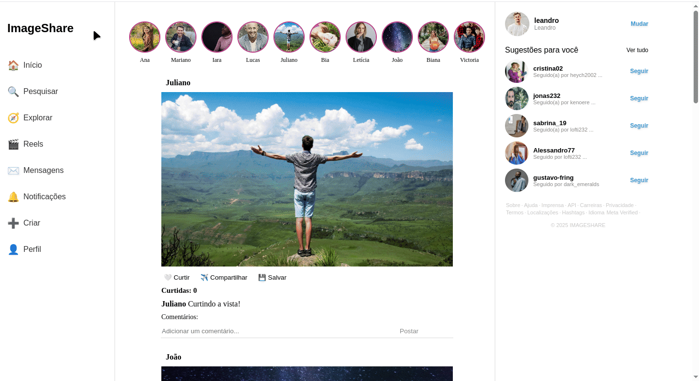

# Image Sharer Homepage Clone

📌 Este documento está escrito em inglês. Para a versão em inglês, veja o arquivo [README.md](./README.md).

Most of the code uses variable names, functions, etc., in English, while code comments and the interface/page text content are in Brazilian Portuguese.

👉  [See the project in action](https://evecleison.github.io/image-share-homepage-clone/)

## Project Description

A front-end project inspired by the Instagram Web homepage. Developed using React, JavaScript, and Vite. Additionally, pure CSS was used for styling and responsiveness across different screen widths.

## 🎥 Demo



## 🔧 Installation and Execution

1. Clone this repository:
    ```bash
    git clone https://github.com/evecleison/image-share-homepage-clone.git
    ```
2. Install the dependencies:
    ```bash
    npm install
    ```
3. Start the development server:
    ```bash
    npm run dev
    ```
4. Open the project in your browser:
    ```bash
    http://localhost:5173
    ```

## 🛠️ Technologies Used

- React  
- JavaScript  
- CSS  
- Vite

## 👨‍💻 Author

- Evecleison Albuquerque do Nascimento

## 📄 License

This project is licensed under the MIT License.  
See the [LICENSE](./LICENSE) file for more details.

